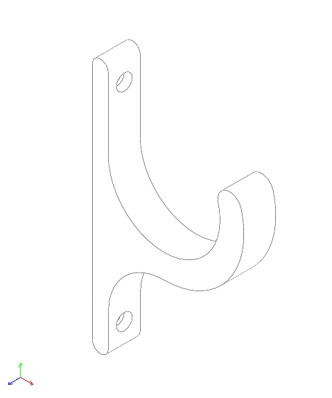

# Wall Hook

This is a sturdy hook, suitable for mounting on a wall.

| dimension (mm)          |     |
|-------------------------|-----|
| height                  | 150 |
| depth                   | 95  |
| hook diam.              | 70  |
| mount hole diam.        | 5   |
| mount hole recess diam. | 10  |
| mount hole dist.        | 130 |

You will need [SolveSpace](https://solvespace.com/) to edit the design.